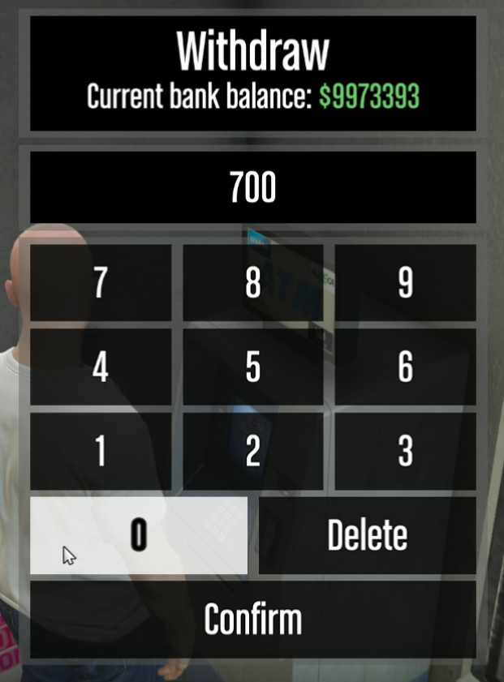

<a name="readme-top"></a>
<!-- PROJECT LOGO -->
<br />
<div align="center">
  <a href="https://github.com/Andreas1331/ragemp-keypad">
    
  </a>

<h3 align="center">RageMP generic keypad</h3>

  <p align="center">
    This allows you to create keypads and display them to the player at any given time.
    <br />
    <a href="https://github.com/Andreas1331/ragemp-keypad"><strong>Explore the code</strong></a>
    <br />
    <br />
    <p><i>Disclaimer: This was originally developed in 2019ish, so it might not work</i></p>
  </p>
</div>

<!-- TABLE OF CONTENTS -->
<details>
  <summary>Table of Contents</summary>
  <ol>
    <li><a href="#about-the-project">About The Project</a></li>
    <li><a href="#prerequisites">Prerequisites</a></li>
    <li><a href="#getting-started">Getting Started</a></li>
    <li><a href="#demonstration">Demonstration</a></li>
    <li><a href="#license">License</a></li>
    <li><a href="#contact">Contact</a></li>
  </ol>
</details>

<!-- ABOUT THE PROJECT -->
## About The Project

Originally created around 2019, so it might be broken with newer versions of RageMP, though I believe I fixed this at some point. 

The system allows you to set up a keypad server-side and hook an action to the Confirm button in the keypad. The action is invoked server-side and as argument you get the value which the user put in the keypad client-side. You can set the title, subtitle and even control of the input in the field will be asterisks for cases where the player would be typing a pin etc.

The entire keypad requires no CEF at all, and no web related dependencies. Instead the whole thing is defined and rendered using native GTA:V UI elements.

<p align="right">(<a href="#readme-top">back to top</a>)</p>

## Prerequisites

You wont need much..
* A RageMP server with C#

<p align="right">(<a href="#readme-top">back to top</a>)</p>


<!-- GETTING STARTED -->
## Getting Started

To get started put the ```keypad.js``` in your client folder and remember to include it in the ```index.js```. Then grab the ```KeypadLibrary.cs``` and put it in your server project. With this you are ready to create keypads wherever you need them.
Invoke the following function:
```
StartKeypadForPlayer(Player player, string title, string subTitle, bool useAsterisk, Action<Player,int> callback)
```
as such:
```
KeypadLibrary.StartKeypadForPlayer(
    ply, "Withdraw", 
    $"Current bank balance: ~g~${ply.cash}", 
    false, 
    (ply, x) =>
    {
        ply.SendChatMessage("You are withdrawing: " + x);
    });
```
The system supports all native colors from GTA:V so you can color the title and subtitle if needed.

<p align="right">(<a href="#readme-top">back to top</a>)</p>

<!-- DEMONSTRATION -->
## Demonstration
<p align="center"></p>

<!-- LICENSE -->
## License

Distributed under the MIT License. See `LICENSE.txt` for more information.

<p align="right">(<a href="#readme-top">back to top</a>)</p>


<!-- CONTACT -->
## Contact

Andreas  - **Website to be inserted**

<p align="right">(<a href="#readme-top">back to top</a>)</p>
